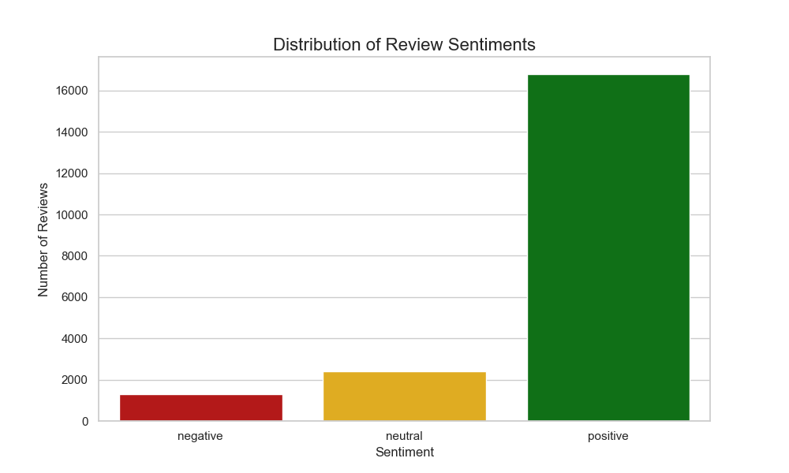

# Serendipity Engine: AI-Powered Hotel Review Analysis

This project is a complete data science pipeline that analyzes the sentiment of over 20,000 hotel reviews. It uses Python and a state-of-the-art AI model to classify reviews as positive, negative, or neutral, and then visualizes the results.

## Final Result


## Features
* **Data Cleaning:** Raw text from reviews is cleaned by removing punctuation, converting to lowercase, and removing common "stop words."
* **Sentiment Analysis:** Uses the `cardiffnlp/twitter-roberta-base-sentiment` model from Hugging Face Transformers to analyze the sentiment of each review.
* **Data Visualization:** Generates a bar chart showing the final distribution of positive, negative, and neutral sentiments across the entire dataset.

## Technologies Used
* Python
* Pandas - For data manipulation and analysis.
* NLTK (Natural Language Toolkit) - For text cleaning.
* Hugging Face Transformers & PyTorch - For running the sentiment analysis AI model.
* Matplotlib & Seaborn - For creating the final data visualization.
* Git & GitHub - For version control and publishing.

## How to Run
1.  Set up a Python virtual environment:
    ```
    python -m venv venv
    venv\Scripts\Activate
    ```
2.  Install the required packages:
    ```
    pip install pandas nltk transformers torch matplotlib seaborn
    ```
3.  Download the dataset from [Kaggle](https://www.kaggle.com/datasets/andrewmvd/trip-advisor-hotel-reviews) and place the `tripadvisor_hotel_reviews.csv` file in the `data` folder as `hotel_reviews.csv`.

4.  Run the final analysis and visualization script:
    ```
    python scripts/visualize_sentiments.py
    ```